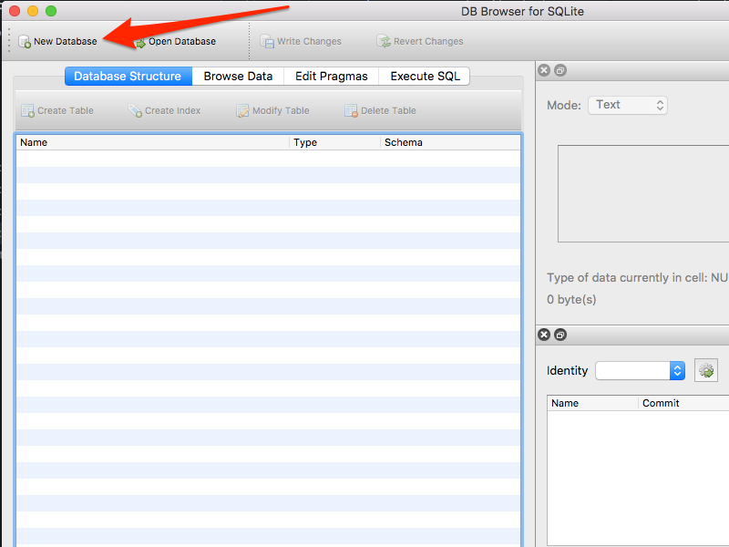
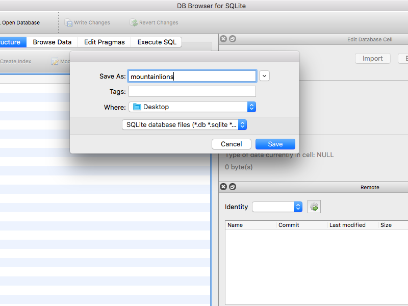
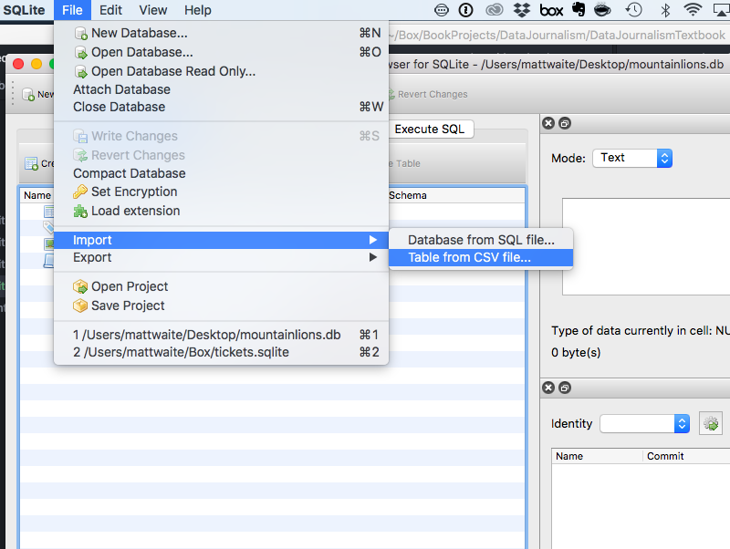
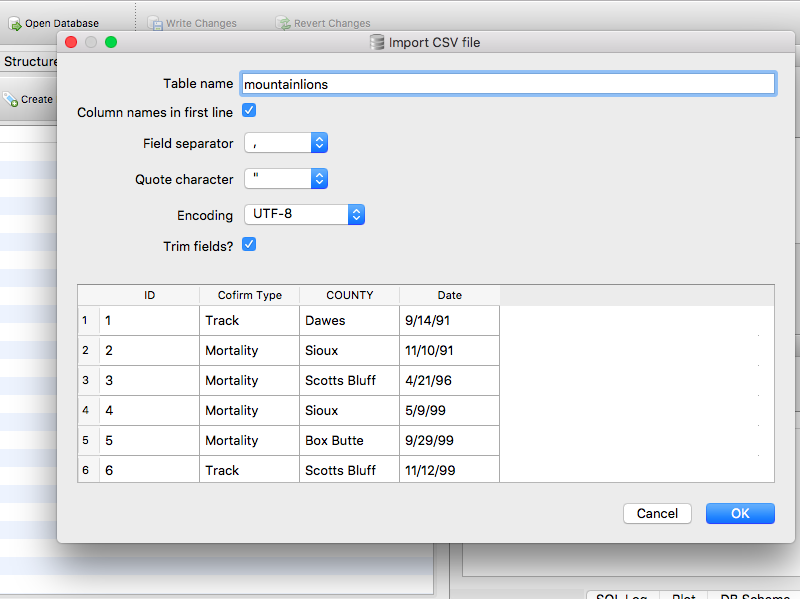
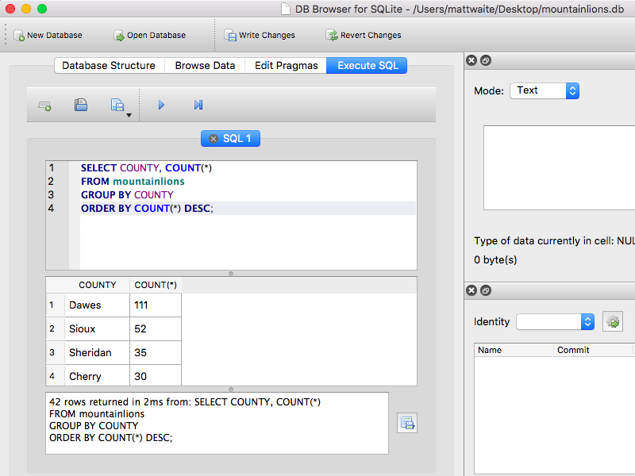

# Group By

Like many newsrooms, reporters at St. Louis Public Radio heard the common story that violent crime goes up when the weather gets hot.

Brent Jones, a visual data journalist there, worked with a reporter and editor to find out.

"We were looking for a summer story, and have talked about putting more of a focus on gun violence," he said.

To do the story, Jones needed three things: police data, weather data, and knowing how to Group By. With data from the St. Louis Police Department, daily high temperature data from the National Weather Service, [the rest was just doing the analysis](https://github.com/stlpublicradio/2018-05-31-crime-and-heat-analysis/blob/master/crimes-and-heat.ipynb).

When they were done, they found the anecdotes were true: [crime in St. Louis does indeed edge higher when the temperature gets hotter](http://news.stlpublicradio.org/post/warm-weather-worries-st-louis-when-temperatures-rise-crime-often-follows#stream/0).


### The nut graph

Group By is one of the most basic, and most critical, skills in data analysis. It takes any number of things and groups them together by some common element. Imagine, if you will, you had a bag of Skittles candy spilled out on the table in front of you. Group By takes the yellow ones and puts them in a pile, and the green ones, and the purple ones, and so on.

The term Group By comes from databases -- specifically the Structured Query Language (SQL) command GROUP BY -- but it has analogues in every analysis platform out there.

In this module, you'll learn:

* The steps to grouping your data together
* An introduction to summarizations after you have grouped the data
* Ordering data to show differences

### The walkthrough

For this exercise, we're going to use SQL, or Structured Query Language, the language of databases. Group By is one of the foundational components of data analysis.

First you need data. For this example, we're going to use a dataset of verified mountain lion sightings in Nebraska. The data is useful to provide context to stories of the big cats being spotted in places they aren't usually found -- particularly around Nebraska's major cities of Lincoln and Omaha. [Stories pop up](http://krvn.com/regional-news/woman-reports-mountain-lion-sighting-in-lincoln/) from time to time, but rarely include context. The state Game and Parks department keeps track of confirmed sightings. Let's import that data and look at it.

For this, we'll use DB Browser for SQLite. SQLite is a free, open source database program you probably already have on your computer, but it's simple to install. DB Browser is a front end to SQLite, making it much nicer to work with. Whatever database implementation you use, GROUP BY is part of it and the SQL we use here will work.

Here's a short screencast to show you how it all works.

[](http://www.youtube.com/watch?v=FY2y33Ag-Jg "Excel Screencast")

If screencasts don't work for you, here's a step by step walkthrough.

First, we need to create a database for our table to appear in. A database is a collection of tables, among other things. A table is a collection of records. We're going to create a database to store a table of records of mountain lion sightings.

First, we'll click on New Database, and when the window pops up, we'll give it a name and save it somewhere we want to store it.





DB Browser, once you create a new database, immediately pops up a window to create tables. Cancel that, and go to File > Import > Table from CSV file.



Select the mountainlions.csv file from where you saved it, and click Open. DB Browser will try to infer the field types. You should make sure the box that says "Column names in first line" is checked, because the column names are indeed in the first line.



Hit okay. Then click Browse Data.

Note: We have four fields:
* ID, an number for each sighting
* A misspelled field that should be Confirm Type, which tells you how the state confirmed that it was a real mountain lion
* COUNTY, which is what you think it is.
* And Date, which is when the sighting occurred.

With this data, what is a logical question to ask? How about this one: Which counties have the most mountain lion sightings?

To answer that, we'll group them together using SQL, specifically we'll use GROUP BY. If you click the Execute SQL button, you'll get a blank window where we can issue some SQL commands.

Most of your queries in SQL will begin with SELECT, and this is no different. We need to SELECT fields, specifically COUNTY. So first try this:

```
SELECT COUNTY FROM mountainlions;
```

NOTE: The semicolon at the end just indicates the end of a command. It's not necessary here, but it's good practice.

Click the triangle above the window to run that. If you did it right, you should get a 393 record response that just has the county names. That's good, but not particularly useful. We want a count of unique counties, so we know how many Sioux County sightings there are, along with all the others.

So we need to add GROUP BY. Try this:
```
SELECT COUNTY
FROM mountainlions
GROUP BY COUNTY;
```
The answer you'll get is 42 rows, but you still don't know how many of each county appears in the dataset, just that there's 42 unique counties.

So we need to add one more thing: A function. A function conveniently called COUNT. So try this:
```
SELECT COUNTY, COUNT(*)
FROM mountainlions
GROUP BY COUNTY;
```

Ahh, that's better, but wait, it's not ordered. Well, it is, it's just in alphabetical order by county. That's useless. So let's order it by the count of each county. To do this, you need to know one thing: The default order of sorting is in ASCENDING order, or smallest to largest. We want the largest to smallest, or DESCENDING order. To do that, we'll add an `ORDER BY` command.
```
SELECT COUNTY, COUNT(*)
FROM mountainlions
GROUP BY COUNTY
ORDER BY COUNT(*) DESC;
```


And that answers our question. Dawes County has the most sightings, followed by Sioux, Sheridan and Cherry Counties.

Things to note:

* If you're not a Nebraska geography nerd, most of those counties are across the north and northwestern parts of the state in an area called the Pine Ridge.
* Lincoln, the city, is in Lancaster County. According to this data, there have been zero confirmed sightings in Nebraska's second most populous county. Omaha is in Douglas County, the state's most populous county, with two confirmed sightings.
* Look carefully at Sheridan County. Scan down the list of counties. See any problems? How might this affect your analysis?

### Resources for instructors

* Potential assignment: Use local or campus crime data to answer a series of questions. Examples: If you have multiple years of data, how many crimes were reported each year? What is the most common crime type? Which month has the most reported crime?
* Potential assignment: Use salary data from your city or university. Use group by and create the following summaries by job title: count, median and mean. Discuss the differences. For instance, my university salary data includes a very expensive football coach, a moderately expensive basketball coach, and a lot of well-paid assistant coaches before we get to chancellors and vice chancellors. How does that affect the numbers?

### Suggested reading

* Jones' [code analyzing crime and temperature data](https://github.com/stlpublicradio/2018-05-31-crime-and-heat-analysis/blob/master/crimes-and-heat.ipynb).
* [Notes on working with big-ish data](https://source.opennews.org/articles/notes-working-big-ish-data/)
